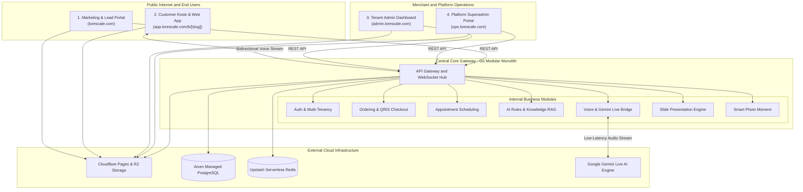

# Lorescale VoiceTalk — Solution Design & System Architecture Document

* **Document Type:** Solutions Architecture Document (SAD)
* **Author:** Office of the CTO
* **Status:** Draft / Active Development
* **Target Audience:** Engineering, Product, Founders, Stakeholders

---

## 1. Executive Summary & Product Vision

### 1.1 The Market Problem
Physical retail stores, restaurants, salons, and corporate presentation spaces face high labor costs, staff turnover, language barriers, and slow peak-hour ordering or inquiry times. Traditional self-service kiosks are expensive, clunky, and lack human engagement, while mobile apps suffer from 80%+ friction and download drop-off.

### 1.2 The Lorescale Solution
**Lorescale (VoiceTalk)** is a zero-install **AI Digital Human & Voice Automation Platform**. Customers and visitors simply open a URL or scan an in-store QR code (`/b/{store-slug}`) on any tablet or smartphone to interact naturally in real-time with an expressive 3D Digital Human that speaks, listens, and acts.

```
       [ Zero-Install Web / Tablet Kiosk ]
                       │
         "I'd like an iced latte and a croissant"
                       │
                       ▼
       [ 3D Digital Human Assistant (Realtime Voice) ]
                       │
       ┌───────────────┼───────────────┐
       ▼               ▼               ▼
 [ F&B Ordering ] [ Salon Booking ] [ Concierge FAQ ]
       │               │               │
 [ QRIS Payment ] [ Live Slots ]  [ RAG Knowledge ]
```

---

## 2. Supported Business Verticals & Core Use Cases

| Business Vertical | Primary Use Case | Core Value Delivered |
|---|---|---|
| **F&B & Coffee Shops** | **AI Cashier & Order Taker** | Verbal menu navigation, real-time cart modification, smart upselling, QRIS scan-to-pay, and kitchen ticket dispatch. |
| **Salons, Spas & Clinics** | **AI Receptionist & Booking Clerk** | Service duration matching, live calendar availability checks, client contact capture, and automated slot reservation. |
| **Retail & Service Counters** | **AI Concierge & Smart FAQ** | Instant answers to store policies, operating hours, facilities (Wi-Fi, parking), and promotions with zero hallucination. |
| **Corporate & Events** | **AI Presenter & Keynote Speaker** | Autonomous presentation delivery from PPTX files with synchronized slide narration, avatar stage transitions, and audience mic Q&A. |
| **Monetized Add-on** | **Smart Photo Moment** | Post-transaction selfie souvenir booth with branded frames and auto-expiring QR download. |

---

## 3. High-Level Solution Architecture

The system is designed as a **Modular Distributed System**: a centralized backend engine orchestrates real-time AI and data, while lightweight frontend surfaces serve distinct customer and operational touchpoints.



---

## 4. Key Architectural Principles & Strategic Decisions

### Principle 1: Monolith First (Go Modular Monolith)
* **Strategy**: Avoid premature microservices complexity. 
* **Design**: Build a single **Go (Golang) Modular Monolith** where each domain (Commerce, Booking, AI Rules, Billing) is cleanly isolated in internal packages communicating via in-memory events.
* **Benefit**: Extreme concurrency (thousands of voice streams on minimal RAM), sub-second cold starts, simplified debugging, and single-container deployments.

### Principle 2: Zero-Cost Production Infrastructure (Pre-Launch Stage)
* **Strategy**: Build with modern serverless and managed free tiers to achieve **$0/month fixed hosting burn rate** during pre-launch and early testing.
* **Component Selection**:
  * **Frontends**: **Cloudflare Pages** (Static exports, unlimited free bandwidth, global Anycast CDN).
  * **Backend Compute**: **Kubeletto** (Single container runner, full WebSocket support).
  * **Database**: **Aiven PostgreSQL** (1 vCPU, 1GB RAM, 5GB storage, automated backups).
  * **Cache & Queues**: **Upstash Redis** (Serverless TLS Redis for caching & asynchronous jobs).
  * **Media Storage**: **Cloudflare R2** (S3-compatible, 10GB storage, **$0 egress fees**).
  * **AI Voice Streaming**: **Google Gemini Live API** (Bidirectional multimodal audio streaming).

### Principle 3: Edge vs. Cloud Decoupling (Vision Services)
* **Strategy**: Computer vision (YOLOv11 human detection & MediaPipe gestures) is deferred from the cloud and packaged as an **Enterprise On-Premise Hardware Add-on**.
* **Benefit**: Eliminates heavy cloud GPU costs and bandwidth fees, while preserving customer privacy by processing video strictly on local in-store hardware.

### Principle 4: Multi-Tenant Isolation & Abuse Prevention
* **Strategy**: Every resource is strictly scoped by `business_id`.
* **Guardrails**:
  * **Counter Kiosk Mode vs. Public Web**: Merchants can restrict ordering to physically paired counter iPads using a 6-digit PIN.
  * **Session Guardrails**: 3-minute hard conversation caps and 25-second silence auto-hangups to prevent token waste.
  * **Rate Limiting**: IP-based rate limiting via Redis to prevent bot attacks.

---

## 5. Domain Breakdown & System Responsibilities

```
                               ┌─────────────────────────────┐
                               │     Go Modular Monolith     │
                               └──────────────┬──────────────┘
                                              │
    ┌──────────────────┬──────────────────────┼──────────────────────┬──────────────────┐
    ▼                  ▼                      ▼                      ▼                  ▼
[ Auth & Tenancy ] [ Commerce & Checkout ] [ Scheduling Engine ] [ AI Brain & RAG ] [ Slide Presenter ]
• JWT & TOTP 2FA   • Menu Catalog         • Salon Durations      • System Prompts   • PPTX Extraction
• Multi-workspace  • Live Cart State      • Available Slots      • Knowledge Base   • Batch TTS Audio
• 48h Demo Trials  • QRIS Scan-to-Pay     • Booking Calendar     • Tool Dispatcher  • Live Stage WS
```

1. **Auth & Multi-Tenancy**: Governs user accounts, role-based access control (Owner, Admin, Staff, Platform Admin), workspace quotas, and 48-hour demo trial clocks.
2. **Commerce & Checkout**: Manages categorized menus, price calculations, discounts, real-time in-memory shopping carts, and QRIS payment verification.
3. **Scheduling Engine**: Calculates available salon/clinic timeslots based on staff working hours and treatment durations, preventing double-bookings.
4. **AI Brain & RAG**: Compiles store rules, tone, and knowledge base facts into a structured system prompt, preventing hallucination and routing tool calls.
5. **Realtime Voice Streamer**: Handles low-latency bidirectional PCM audio streaming between client devices and Google Gemini Live.
6. **Slide Presenter Engine**: Parses uploaded PPTX decks, generates talking points per slide, synthesizes narration audio via Gemini TTS, and orchestrates live interactive presentations.
7. **Smart Photo Moment**: Manages post-transaction celebration photo captures, overlays custom branded frames, and generates expiring download tokens.

---

## 6. Target Development & Release Roadmap

| Milestone | Key Deliverables | Expected Outcome |
|---|---|---|
| **Phase 1: Foundation** | • Go backend setup with `chi` router & `pgxpool`<br/>• Aiven PostgreSQL & Upstash Redis setup<br/>• `sqlc` type-safe database models | Solid, type-safe foundation with zero infrastructure cost |
| **Phase 2: Core Domain Services** | • Merchant REST APIs (Menu, Appointments, Rules)<br/>• Gemini Live WebSocket audio streaming bridge<br/>• Function calling tools for ordering & booking | Working end-to-end voice ordering and booking flows |
| **Phase 3: Pipelines & Media** | • PPTX deck parser & background TTS worker<br/>• Cloudflare R2 bucket integration for assets<br/>• Photo Moment auto-cleanup worker | Slide presentation keynote & souvenir photo features operational |
| **Phase 4: Frontend Alignment & Pilot** | • Next.js static exports for Cloudflare Pages<br/>• Physical iPad countertop kiosk testing<br/>• Sunrise Coffee pilot launch | Production deployment ready for first merchant trial |

---

## 7. Architectural Sign-Off

* **Scalability**: Capable of handling thousands of concurrent voice sessions with sub-second latency.
* **Maintainability**: Clear domain boundaries, compile-time type safety, and zero external microservice overhead.
* **Cost Efficiency**: $0.00/month fixed hosting footprint during development and beta testing.
