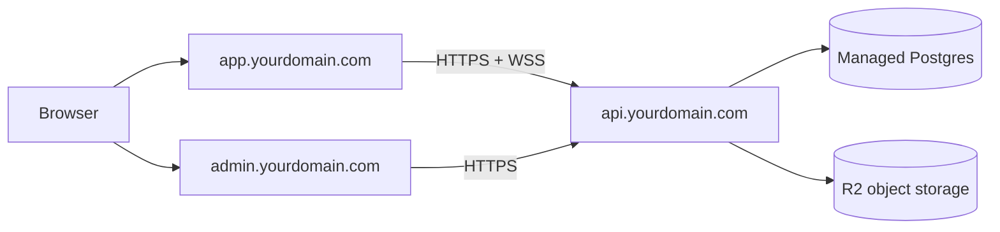

# Deploy to your custom domain

Example layout (replace `yourdomain.com` with yours):

| Subdomain | Service | Hosts |
|---|---|---|
| `api.yourdomain.com` | Your container host | Elysia on Bun (`apps/server`) — REST + WebSocket |
| `app.yourdomain.com` | Vercel | Customer voice UI (`apps/customer-app`) |
| `dashboard.yourdomain.com` | Vercel | Merchant admin (`apps/admin-app`) |
| `admin.yourdomain.com` | Vercel | Super Admin / platform ops (`apps/super-admin-app`) |
| `yourdomain.com` | Vercel (optional) | Marketing site (`apps/marketing-app`) |


```mermaid
flowchart LR
  User[Browser]
  App[app.yourdomain.com]
  Admin[admin.yourdomain.com]
  API[api.yourdomain.com]
  PG[(Managed Postgres)]
  R2[(R2 object storage)]

  User --> App
  User --> Admin
  App -->|HTTPS + WSS| API
  Admin -->|HTTPS| API
  API --> PG
  API --> R2
```

---

## Prerequisites

- [Database + object storage configured](DEPLOY.md) (Aiven Postgres, Cloudflare R2)
- A container host (VM + Docker, Fly.io, Railway, Cloud Run, Kubernetes…)
- Domain DNS managed (Cloudflare, Namecheap, etc.)
- GitHub repo pushed

---

## Step 1 — Deploy the API container

1. Build or pull the image (CI publishes `ghcr.io/<owner>/<repo>:latest`):

```bash
docker pull ghcr.io/sirensstudio7/voice-talk:latest
# or: docker build -f apps/server/Dockerfile -t voice-talk-api .
```

2. Run it with the production env file (see [`DEPLOY.md`](DEPLOY.md) for the
   full variable list):

```bash
docker run -d --name voice-talk-api --restart unless-stopped \
  --env-file apps/server/.env.production.local \
  -p 8000:8000 ghcr.io/sirensstudio7/voice-talk:latest
```

Set `PLATFORM_ADMIN_EMAIL` and `PLATFORM_ADMIN_PASSWORD` in the API's secret
environment before first startup. The server seeds that account only when the
email is not already present. To explicitly reset an existing account, run
`bun run platform-admin:reset-password` inside the API container with those
variables set; it updates only that account's password hash and records an
audit event.

Or use [`docker-compose.prod.yml`](../docker-compose.prod.yml):
`docker compose -f docker-compose.prod.yml up -d`.

3. Verify: `curl http://localhost:8000/health` (add `?db=1` to ping Postgres + Redis).

4. TLS/domain: terminate HTTPS either at your platform router or with a
   reverse proxy in front of the container, e.g. Caddy:

```
api.yourdomain.com {
    reverse_proxy 127.0.0.1:8000
}
```

Point `PUBLIC_API_URL` (required in production) at the public origin —
`https://api.yourdomain.com` above.

---

## Step 2 — Deploy customer app on Vercel

Any Next.js host works; the Vercel flow below is the shortest path.

1. [vercel.com](https://vercel.com) → Import repo
2. **Root Directory:** `apps/customer-app`
3. **Environment variables:**

```env
NEXT_PUBLIC_API_URL=https://api.yourdomain.com
NEXT_PUBLIC_WS_URL=wss://api.yourdomain.com/ws/session
```

4. Deploy
5. **Settings → Domains** → add `app.yourdomain.com`
6. Add DNS CNAME Vercel provides:

```
app  CNAME  cname.vercel-dns.com
```

---

## Step 3 — Deploy merchant admin on Vercel

1. New Vercel project, **Root Directory:** `apps/admin-app`
2. **Environment variables:**

```env
NEXT_PUBLIC_API_URL=https://api.yourdomain.com
NEXT_PUBLIC_CUSTOMER_APP_URL=https://app.yourdomain.com
```

3. **Domains** → `dashboard.yourdomain.com`

---

## Step 3b — Deploy Super Admin on Vercel

1. New Vercel project, **Root Directory:** `apps/super-admin-app`
2. **Environment variables:**

```env
NEXT_PUBLIC_API_URL=https://api.yourdomain.com
```

3. **Domains** → `admin.yourdomain.com` (LORESCALE: `admin.lorescale.com`)
4. After API deploy + migration `019_platform_admin.sql`, seed creates the first Super Admin from `PLATFORM_ADMIN_EMAIL` / `PLATFORM_ADMIN_PASSWORD`. First login requires TOTP setup.

---

## Step 4 — (Optional) Marketing site

1. Vercel project, **Root Directory:** `apps/marketing-app`
2. Env:

```env
# Use real URLs only — template placeholders break the landing-page hero iframe.
# Leave unset to use defaults: voice-talk-customer.vercel.app + app.lorescale.com
NEXT_PUBLIC_CUSTOMER_APP_URL=https://app.yourdomain.com
NEXT_PUBLIC_ADMIN_APP_URL=https://dashboard.yourdomain.com
```

3. Domain: `yourdomain.com` or `www.yourdomain.com`

---

## Step 5 — Smoke test

| Check | URL |
|---|---|
| API health | `https://api.yourdomain.com/health` |
| Menu | `https://api.yourdomain.com/menu?business=sunrise-coffee` |
| Customer voice | `https://app.yourdomain.com/b/sunrise-coffee` |
| Merchant admin | `https://dashboard.yourdomain.com` |
| Super Admin | `https://admin.yourdomain.com` |

Voice WebSocket must use `wss://` (not `ws://`) on HTTPS sites.

---

## Host sizing note

Free/scale-to-zero tiers **sleep** after idle. First request is slow and
voice WebSockets drop mid-session — use an always-on instance (any provider)
for production. The API is stateless; uploads go to R2 and state lives in
Postgres/Redis, so you can run more than one replica.

---

## Quick reference — your `.env` for local dev

```env
DATABASE_URL=postgresql://localhost:5432/voicetalk
REDIS_URL=redis://127.0.0.1:6380
# S3_* optional locally: uploads land in apps/server/uploads/
GEMINI_API_KEY=...
JWT_SECRET=...
NEXT_PUBLIC_API_URL=http://localhost:8000
NEXT_PUBLIC_WS_URL=ws://localhost:8000/ws/session
```

Production frontends use `https://api.yourdomain.com` instead of localhost.
