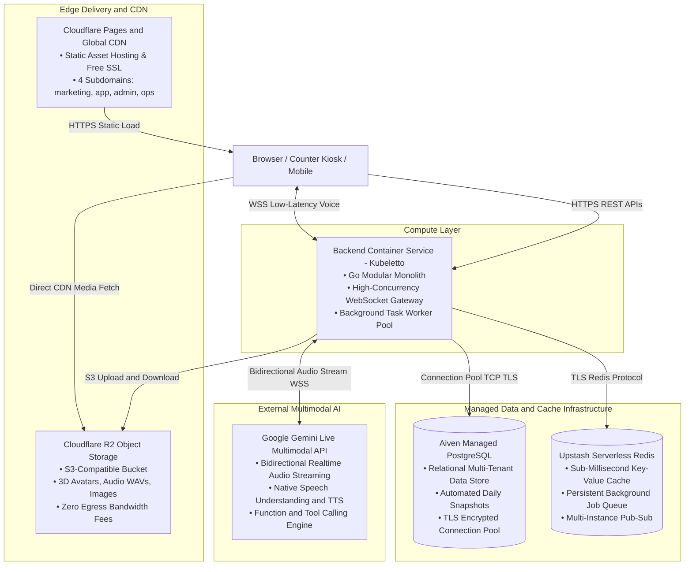
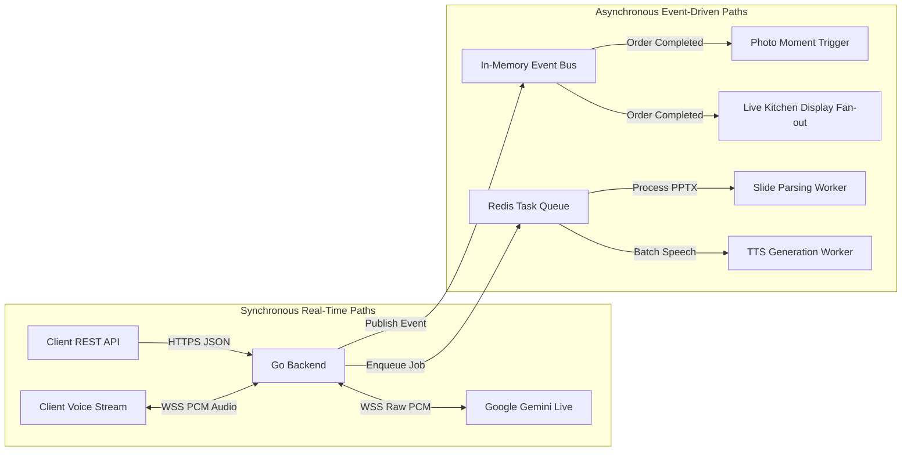
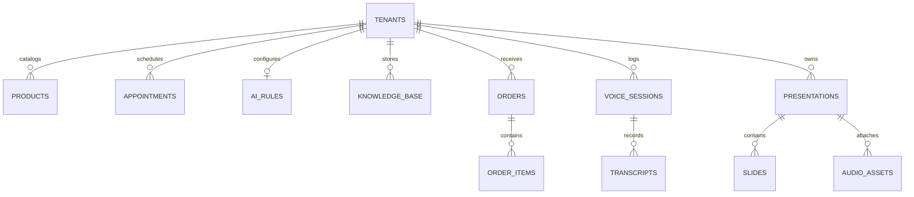
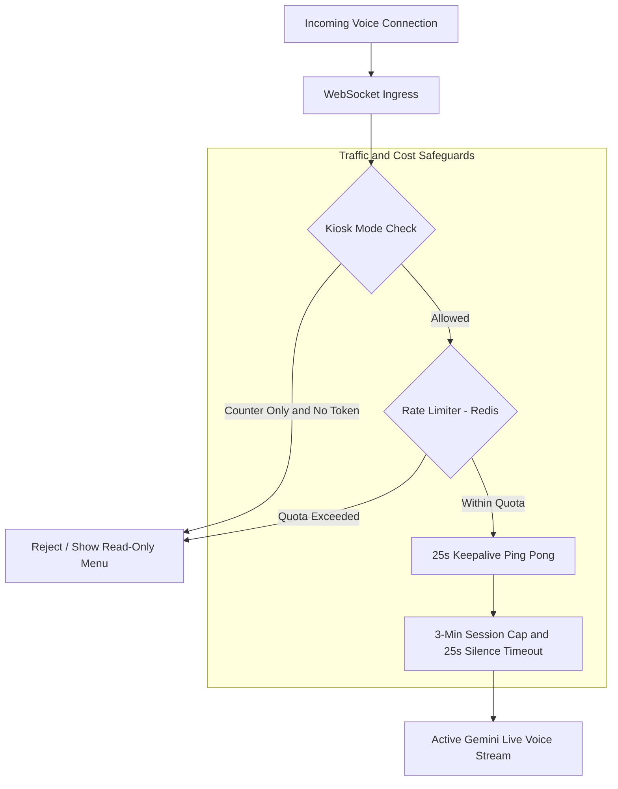

# Lorescale VoiceTalk — Technical Architecture & Infrastructure Specification

* **Document Type:** Technical Architecture Specification (TAS)
* **Author:** Office of the CTO
* **Status:** Draft / Active Development
* **Target Audience:** Backend Engineers, Frontend Engineers, DevOps, Tech Leads

---

## 1. System Topology & Infrastructure Blueprint

The production architecture is built on a **decoupled, serverless-first and containerized infrastructure** designed for high throughput, sub-second voice latency, and zero fixed hosting overhead during development and pilot phases.

---

## 2. Full Technology Stack Inventory

| Architectural Layer | Selected Technology | Role & Key Responsibilities |
|---|---|---|
| **Frontend Framework** | **Next.js 14+ / React 19** | Built with Static HTML/SPA Export (`output: "export"`) for zero-cold-start hosting on Cloudflare Pages. |
| **Styling & UI Kit** | **Tailwind CSS + Lucide Icons** | Responsive layout engine optimized for countertop landscape tablets (iPads) and mobile portrait displays. |
| **3D Graphics & Avatar Engine** | **Three.js + React Three Fiber (R3F)** | Client-side 60 FPS 3D digital human renderer; executes facial morph blendshapes, viseme lip-sync, and procedural gestures. |
| **Audio Processing** | **Web Audio API + AudioWorklets** | Captures 16kHz PCM audio from microphone; plays back streaming 24kHz PCM audio from AI with amplitude analysis. |
| **Backend Core Runtime** | **Go (Golang)** | High-concurrency modular monolith; manages WebSocket connections, streaming audio bridges, and business logic. |
| **Relational Database** | **PostgreSQL (Aiven)** | Source of truth for multi-tenant accounts, menus, appointments, AI rules, transcripts, orders, and presentations. |
| **Cache & Task Queue** | **Redis (Upstash)** | In-memory key-value caching for compiled AI prompts, tenant rate limits, and asynchronous background worker queues. |
| **Object Storage** | **Cloudflare R2** | S3-compatible cloud object store for 3D model files, store backgrounds, payment QR images, and slide audio assets. |
| **AI Streaming Gateway** | **Google Gemini Live API** | Low-latency multimodal audio streaming and dynamic business function calling engine. |

---

## 3. Communication Protocols: Synchronous vs. Asynchronous

### 3.1 Synchronous Communication Patterns (Low-Latency & Direct)
1. **REST over HTTPS**:
   - Used for administrative CRUD operations (menu editing, AI rule adjustments, appointment setup), authentication, and public catalog lookups.
   - Stateless, cacheable, and secured via JWT headers.
2. **Bidirectional Full-Duplex WebSockets (`wss://`)**:
   - Used for live customer voice sessions (`/ws/session`) and presentation keynotes (`/ws/presenter`).
   - Streams raw 16kHz audio chunks from client to backend $\rightarrow$ piped directly to Google Gemini Live API.
   - Gemini streams back 24kHz audio chunks and transcription events $\rightarrow$ piped directly to the client with sub-second latency.
   - Tool calling requests and responses are multiplexed over the same active WebSocket connection.

### 3.2 Asynchronous Communication Patterns (Decoupled & Background)
1. **In-Memory Domain Events**:
   - Decouples core transactional flows from secondary effects.
   - *Example*: When an order status transitions to `Paid`, an `OrderPaid` event is dispatched internally. The photo souvenir prompt and kitchen notifications react independently without blocking the checkout response.
2. **Persistent Background Task Queues (Redis-backed)**:
   - Heavy, multi-step operations are offloaded from the web request cycle to background worker goroutines.
   - *Example*: PPTX presentation uploads $\rightarrow$ unzipping $\rightarrow$ XML slide parsing $\rightarrow$ batch TTS synthesis per slide $\rightarrow$ Cloudflare R2 audio upload.
   - Includes automatic retries, exponential backoff, and dead-letter handling.
3. **Multi-Instance Pub/Sub (Redis)**:
   - When scaling across multiple backend containers, Redis Pub/Sub synchronizes live events (such as real-time kitchen order tickets or live transcript feeds) across all connected WebSocket instances.

---

## 4. Data Modeling & Storage Strategy

### 4.1 Relational Database Architecture (PostgreSQL)
* **Multi-Tenancy Isolation**: Every transactional table enforces `business_id` scoping to guarantee data isolation between merchants.
* **Connection Pooling Strategy**:
  - The Go backend manages a centralized connection pool (`pgxpool`) configured with a strict budget (`MaxConns: 15`, `MinConns: 2`).
  - Idle connections are automatically reclaimed after 5 minutes, ensuring the application stays comfortably within managed database connection limits.

### 4.2 Caching Strategy (Redis)
* **Compiled AI System Prompts**: Compiling store information, full menus, treatment schedules, and knowledge base facts into a structured AI instruction string is computationally intensive. The compiled prompt is cached in Redis with a 10-minute TTL and invalidated immediately upon merchant configuration updates.
* **Catalog & Public Data**: Menu endpoints (`/menu?business=slug`) are cached in Redis to serve storefront and kiosk queries in under 2 milliseconds.

### 4.3 Object Storage Strategy (Cloudflare R2)
* **Bucket Organization**:
  - `/avatars/`: 3D GLTF/GLB models and blendshape calibration definitions.
  - `/products/`: Product imagery and promotional banners.
  - `/payments/`: Merchant QRIS payment images.
  - `/presentations/`: Uploaded `.pptx` decks and generated per-slide `.wav` audio files.
  - `/photos/`: Temporary Smart Photo Moment souvenir captures (governed by auto-deletion lifecycles).
* **Global Asset Delivery**: Assets are served directly through a dedicated custom subdomain (`assets.lorescale.com`) backed by Cloudflare edge caching, incurring **$0 egress fees**.

---

## 5. Reliability, Security & Traffic Guardrails

### 5.1 Connection Resilience & Proxy Keepalive
* **The Challenge**: Cloud ingress proxies and load balancers terminate idle TCP/WebSocket connections after 60–100 seconds of inactivity.
* **The Solution**: The Go WebSocket hub maintains an active heartbeat mechanism, sending automated ping/pong control frames every **25 seconds**. This keeps connections persistently alive during long pauses without consuming AI token bandwidth.

### 5.2 Token Cost & Anti-Abuse Safeguards
* **Device Pairing (Kiosk-Only Mode)**: Merchants can designate their store as "Counter Kiosk Only." Countertop iPads are paired once via a 6-digit PIN that stores a cryptographic device token in local storage. Public web traffic without this token is served a read-only menu, preventing unauthorized voice usage.
* **Hard Session Duration Budgets**: Individual voice conversations are hard-capped at **3 minutes** per session.
* **Silence Auto-Hangup**: If a visitor leaves the counter or stops speaking for **25 seconds**, the system automatically triggers a polite closing phrase, gracefully ends the session, and resets the interface.
* **IP Rate Limiting**: Redis enforces a maximum threshold of 5 concurrent voice sessions per IP address per hour to mitigate scripted bot attacks.

---

## 6. Architecture Sign-Off Summary

* **Performance**: Optimized for sub-second audio response times using native Go concurrency and low-latency WebSockets.
* **Infrastructure Footprint**: 100% compliant with production-grade free-tier providers (Cloudflare Pages, Kubeletto, Aiven, Upstash, Cloudflare R2).
* **Maintainability**: Clear domain boundaries, asynchronous background processing, and zero-egress cloud asset distribution.
