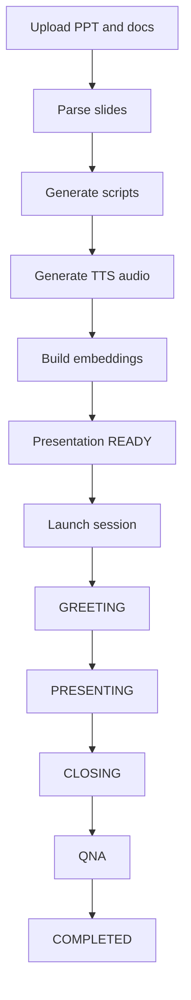

# AI Presenter — Gap Analysis vs VoiceTalk

Analysis of the LORESCALE AI Presenter PRD set ([PRD-1](./PRD-1.md)–[PRD-4](./PRD-4.md)) against the current VoiceTalk / Lorescale monorepo (Fastify + Gemini Live + Supabase voice cashier).

**Date:** 2026-07-31  
**Scope of this doc:** requirements fit and build guidance — not an implementation plan for shipping the product.

---

## 1. Product brief

**LORESCALE AI Presenter** turns static presentation files into an autonomous digital presenter that:

1. Welcomes the audience (greeting)
2. Narrates each slide with synchronized audio + avatar
3. Advances slides on a timing engine
4. Closes the session
5. Answers audience questions via RAG (PPT → notes → supporting docs → org KB)

Target segments: enterprise, education, healthcare, event industry. Business model: subscription / recurring revenue; long-term foundation for a Digital Human Platform.

---

## 2. Stack reconciliation

| PRD assumption | Current VoiceTalk | Recommendation |
|----------------|-------------------|----------------|
| NestJS API | Fastify (`apps/server`) | Keep Fastify; do not introduce NestJS for MVP |
| MinIO object storage | Supabase Storage / local `uploads/` | Use Supabase Storage (or existing upload path) |
| BullMQ + Redis workers | No presentation job queue | Add a worker/queue layer when parse→TTS pipeline lands (Redis/BullMQ or equivalent) |
| OpenAI + Whisper + OpenAI TTS | Gemini Live (realtime voice) | Prefer Gemini (or existing providers) for script/TTS/STT; abstract behind an AI service interface |
| Socket.IO | Native WebSockets (Gemini Live) | Extend existing WS patterns or add Socket.IO only if pub/sub fan-out requires it |
| Existing presentation viewer | Voice cashier / FAQ / booking UIs | New presentation module; reuse admin layout/components |
| Production avatar renderer | `@voicetalk/avatar` (R3F, visemes, gestures) | Reuse package; add stage-driven layout/state from PRD-4 |
| PostgreSQL + pgvector | Supabase Postgres | Stay on Postgres; add pgvector (or Supabase vector) when embeddings ship |
| Monorepo `apps/web` + `apps/api` | `admin-app`, `customer-app`, `server`, etc. | Map presenter admin → `admin-app`; live/audience → new routes or dedicated surface |

**Default build stance:** adapt AI Presenter **into this monorepo** (reuse avatar, auth, knowledge patterns, Next admin UI). Treat NestJS/MinIO/OpenAI-as-specified as PRD legacy assumptions, not hard requirements.

---

## 3. Capability matrix

### Reusable today (strong foundation)

| Capability | Where |
|------------|--------|
| 3D avatar, lip-sync, greeting/idle gestures | `packages/avatar` |
| Multi-tenant businesses, users, admin auth | Supabase schema + `apps/admin-app` / `apps/super-admin-app` |
| Knowledge / FAQ answering patterns | Admin knowledge + server tools |
| Voice presets / TTS voice selection | `packages/shared/src/voice-presets.ts` |
| Session + transcript + analytics scaffolding | `voice_sessions`, admin conversations/stats |
| Next.js admin list/detail patterns | `apps/admin-app` |

### Partial overlap (needs redesign)

| PRD capability | Closest existing piece | Gap |
|----------------|------------------------|-----|
| Live Q&A via mic | Customer PTT + Gemini Live | Scripted presenter stages + RAG answers, not free conversational cashier |
| Knowledge / RAG | Business knowledge docs | Slide-chunk embeddings, source priority (PPT→Notes→PDF…), attribution |
| Moderation (FR-011) | Limited / informal | Toxic, injection, jailbreak, profanity, PII pipeline + audit |
| Analytics | Session/order stats | Audience count, completion, Q&A counts, presentation export |
| Avatar states | Idle / talking / wave | Full stage machine per PRD-4 (Greeting→Transition→Presenting→Closing→QNA) |

### Greenfield (not present)

- Domain entities: `presentations`, `slides`, `presentation_files`, `audio_assets`, presenter `sessions`, `questions`, `embeddings` (see PRD-3)
- PPT/PDF/DOCX/TXT parse pipeline (`python-pptx` or equivalent worker)
- Async jobs: parse → script → TTS assets → embeddings
- Per-slide narration audio + slide timing engine
- Operator control plane (start/pause/resume/next/prev/end) over realtime
- Routes/screens from PRD-4 (`/presentations`, `/sessions/.../live`, processing/preview)
- Audience question submission during live presenter sessions

---

## 4. Functional requirements coverage

| FR | Title | Status |
|----|-------|--------|
| FR-001 | Presentation creation | Missing |
| FR-002 | File upload (PPT/PDF/DOCX/TXT) | Partial — other upload paths exist; not presentation pipeline |
| FR-003 | PPT parsing | Missing |
| FR-004 | Script generation | Missing |
| FR-005 | Voice generation (per-slide assets) | Partial — live Gemini TTS, not pre-generated slide assets |
| FR-006 | Knowledge base / embeddings | Partial — knowledge text; not presentation RAG |
| FR-007 | AI presentation execution (stages) | Missing |
| FR-008 | Operator control | Missing |
| FR-009 | Audience mic questions | Partial — customer mic elsewhere |
| FR-010 | AI Q&A with source attribution | Partial — FAQ; no attribution contract |
| FR-011 | Moderation layer | Missing |
| FR-012 | Presentation analytics + export | Partial — different metrics |

---

## 5. Suggested MVP cut mapped to apps

| Surface | App | Responsibility |
|---------|-----|----------------|
| Presentation CRUD, processing, preview, launch, analytics | `apps/admin-app` | New `/presentations` and `/sessions` modules (PRD-4) |
| REST + job enqueue + session APIs | `apps/server` | New Fastify routes/modules; workers for parse/script/TTS/embed |
| Live audience / projector view | `apps/customer-app` or new route surface | Stage layouts from PRD-4; subscribe to session events |
| Avatar rendering | `packages/avatar` | Stage positions, talking/thinking/answering states |
| Shared types / session event names | `packages/shared` | Presentation status, Socket/WS event contracts |

Existing AI Cashier / FAQ / booking flows stay unchanged; AI Presenter is an additive product line.

---

## 6. Recommended phased build order

Implementation is **out of scope** for the PRD ingest work. If/when building:

### Phase A — Domain + ingest

- Schema for presentations, files, slides (soft-delete / multi-tenant friendly)
- Upload to Supabase Storage
- Parse PPTX → structured slides + notes + media metadata
- Processing status UI + failure/retry

### Phase B — Script + voice + preview

- LLM script generation per slide (regeneratable)
- Batch TTS → audio assets + duration
- Slide preview screen (slide left / script right)
- Mark presentation `ready`

### Phase C — Live session + avatar stages

- Session lifecycle state machine (PRD-2 / PRD-4)
- Operator controls over realtime
- Avatar stage layouts (center greeting → bottom-right presenting → center closing)
- Slide timing engine (speech duration + pause buffer)

### Phase D — Q&A + moderation + analytics

- STT → moderation → RAG → LLM → TTS → avatar
- Source attribution + blocked/answered queues
- Session analytics + export
- Reconnect / state restore on refresh

---

## 7. Risks

| Risk | Mitigation |
|------|------------|
| AI hallucination | RAG-first, source attribution, refuse out-of-corpus questions |
| Large PPT processing | Queue, chunked workers, clear failed/retry UX |
| LLM/TTS cost explosion | Caching, token/usage quotas, prefer batch TTS over always-on Live where possible |
| Long-running sessions | Heartbeat, persisted session state, auto-reconnect |
| Stack fork (NestJS inside Fastify monorepo) | Align architecture to Fastify + Supabase + workers; update PRD tech notes when implementing |

---

## 8. Open questions

Preserved from PRD-3:

- White-label strategy
- Enterprise dedicated deployment
- AI model abstraction layer
- Multi-region deployment
- Video export generation
- AI-generated presentation creation
- Real-time translation

Repo-specific decisions before implementation:

1. **Confirm adapt-in-monorepo** vs separate LORESCALE presenter codebase
2. **Queue technology** (BullMQ/Redis vs other) and where workers run
3. **STT/TTS provider** for batch slide audio vs live Q&A (Gemini vs OpenAI vs mixed)
4. **Audience surface** — extend `customer-app` vs new presenter viewer app
5. **pgvector / embedding store** placement relative to existing knowledge tables

---

## 9. Out of scope (this analysis / PRD ingest)

- Implementing AI Presenter features
- Migrating the server to NestJS or introducing MinIO solely to match the PRD
- Redesigning the existing AI Cashier product

See [README.md](./README.md) for the document index.
