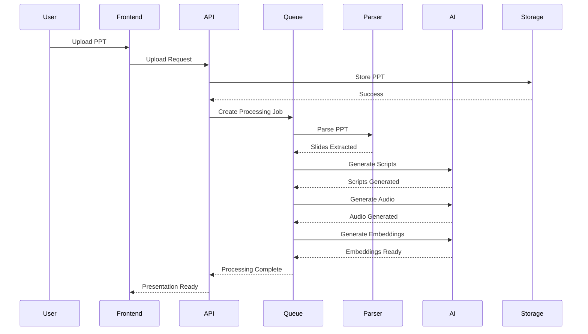
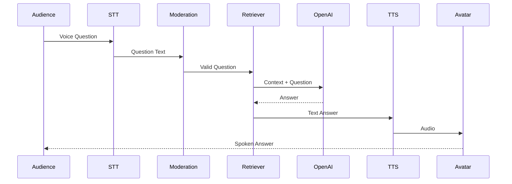

## 3. Core Features (Lanjutan)

---

# Feature 2 — PPT Processing Engine

Priority:

```text
MUST
```

### Tujuan

Mengubah file PowerPoint menjadi struktur data yang dapat diproses AI.

### Deskripsi

Engine bertanggung jawab melakukan parsing terhadap seluruh isi presentasi dan mengubahnya menjadi format terstruktur.

### Input

- PPT
- PPTX

### Output

- Slides
- Notes
- Images
- Tables
- Charts
- Metadata

### Acceptance Criteria

- Semua slide berhasil diekstrak.
- Struktur slide konsisten.
- Metadata lengkap.

### Edge Cases

- Corrupt PPT
- Missing Fonts
- Embedded Video
- Unsupported Object

### Technical Notes

Parser menggunakan:

```text
python-pptx
```

Pipeline:

```text
PPT Upload
 ↓
Extract Slides
 ↓
Extract Notes
 ↓
Extract Media
 ↓
Generate Metadata
 ↓
Store
```

---

# Feature 3 — AI Script Generation

Priority:

```text
MUST
```

### Tujuan

Menghasilkan narasi presenter secara otomatis.

### Deskripsi

LLM menghasilkan script berdasarkan:

- Slide Content
- Speaker Notes
- Presentation Context

### Acceptance Criteria

- Script natural.
- Tidak mengulang slide sebelumnya.
- Menyesuaikan bahasa presentasi.

### Edge Cases

- Slide hanya gambar.
- Slide tanpa teks.
- Slide hanya tabel.

### Technical Notes

Prompt Structure:

```text
System Prompt
+
Presentation Context
+
Current Slide
+
Previous Slide Summary
+
Speaker Notes
```

Output:

```json
{
  "slideId":"slide_001",
  "script":"..."
}
```

---

# Feature 4 — AI Voice Engine

Priority:

```text
MUST
```

### Tujuan

Menghasilkan audio presenter.

### Acceptance Criteria

- Audio sinkron.
- Voice natural.
- Mendukung multi language.

### Edge Cases

- TTS timeout
- Audio corrupt
- Unsupported language

### Technical Notes

Audio format:

```text
MP3
48kHz
```

---

# Feature 5 — Avatar Presentation System

Priority:

```text
MUST
```

### Tujuan

Menampilkan digital presenter.

### States

```text
Idle
Greeting
Talking
Thinking
Answering
Closing
```

### Acceptance Criteria

- Posisi avatar sesuai stage.
- Lip sync berjalan.
- Animation tidak patah.

### Edge Cases

- Avatar asset gagal load.
- Browser GPU issue.

### Technical Notes

Render menggunakan existing production renderer.

---

# Feature 6 — Slide Timing Engine

Priority:

```text
MUST
```

### Tujuan

Mengontrol perpindahan slide otomatis.

### Formula

```text
Speech Duration
+
Pause Buffer
+
Animation Delay
=
Slide Duration
```

### Acceptance Criteria

- Tidak memotong audio.
- Tidak terlalu lama.

### Technical Notes

Buffer default:

```text
2 Seconds
```

---

# Feature 7 — Q&A Engine

Priority:

```text
MUST
```

### Tujuan

Menjawab pertanyaan audiens.

### Flow

```text
Question
 ↓
STT
 ↓
Moderation
 ↓
Retrieval
 ↓
LLM
 ↓
Answer
 ↓
TTS
 ↓
Avatar
```

### Acceptance Criteria

- Jawaban relevan.
- Referensi sumber tersedia.

### Edge Cases

- Pertanyaan di luar materi.
- Pertanyaan ambigu.
- Pertanyaan berulang.

---

# Feature 8 — Knowledge Base Engine

Priority:

```text
MUST
```

### Tujuan

Membangun sumber pengetahuan.

### Sources

- PPT
- Notes
- PDF
- DOCX
- TXT
- Organizational Knowledge Base

### Acceptance Criteria

- Embedding tersedia.
- Retrieval cepat.

---

# Feature 9 — Moderation Layer

Priority:

```text
MUST
```

### Tujuan

Mencegah penyalahgunaan AI.

### Detection

- Toxic
- Prompt Injection
- Jailbreak
- Profanity
- PII

### Acceptance Criteria

- Pertanyaan berbahaya diblok.
- Audit tersimpan.

---

# Feature 10 — Analytics System

Priority:

```text
SHOULD
```

### Tujuan

Mengukur performa presentasi.

### Metrics

- Audience
- Questions
- Completion
- Engagement

---

## 4. User Flow

# Happy Path

```text
User Login
 ↓
Create Presentation
 ↓
Upload PPT
 ↓
Upload Supporting Documents
 ↓
Processing
 ↓
Ready
 ↓
Launch Session
 ↓
Greeting
 ↓
Presentation
 ↓
Closing
 ↓
Q&A
 ↓
Complete
```

---

# Alternative Path

## Operator Skip Slide

```text
Current Slide
 ↓
Operator Next
 ↓
Audio Stop
 ↓
Transition
 ↓
Next Slide
```

---

## Operator Pause

```text
Presentation
 ↓
Pause
 ↓
Voice Stop
 ↓
Avatar Idle
 ↓
Resume
 ↓
Continue
```

---

# Error Handling

## PPT Parsing Failed

```text
Upload
 ↓
Parser Error
 ↓
Mark Failed
 ↓
Show Error
 ↓
Retry
```

---

## AI Generation Failed

```text
Generate Script
 ↓
Timeout
 ↓
Retry
 ↓
Fallback
```

---

# Empty States

### No Presentation

```text
No Presentation Found

Create Your First Presentation
```

### No Questions

```text
No Questions Yet
```

---

# Loading States

### Processing

```text
Uploading...
Parsing...
Generating Script...
Generating Voice...
Building Knowledge...
```

---

# Failure Recovery

## Browser Refresh

```text
Reconnect
 ↓
Fetch Session
 ↓
Restore State
 ↓
Continue
```

---

## Network Disconnect

```text
Disconnected
 ↓
Auto Reconnect
 ↓
Sync State
 ↓
Resume
```

---

## 5. Architecture

### System Architecture Overview

```text
                    ┌─────────────────┐
                    │     Users       │
                    └────────┬────────┘
                             │
                             ▼
                    ┌─────────────────┐
                    │    Next.js      │
                    │   Frontend UI   │
                    └────────┬────────┘
                             │
                             ▼
                    ┌─────────────────┐
                    │    NestJS API   │
                    └────────┬────────┘
                             │
     ┌───────────────────────┼──────────────────────┐
     ▼                       ▼                      ▼

┌──────────┐         ┌────────────┐        ┌────────────┐
│PostgreSQL│         │   Redis    │        │   MinIO    │
└────┬─────┘         └─────┬──────┘        └─────┬──────┘
     │                     │                     │
     ▼                     ▼                     ▼

Metadata          Queue & Cache          Files & Assets

     └──────────────────────────────────────────────┐
                                                    ▼

                                          ┌────────────────┐
                                          │ Worker Cluster │
                                          └───────┬────────┘
                                                  │
                 ┌────────────────────────────────┼─────────────────────────┐
                 ▼                                ▼                         ▼

          PPT Processor                  AI Services                 Embedding Service

                 ▼                                ▼                         ▼

          python-pptx                    OpenAI APIs              Vector Search
```

---

## High Level Components

### Frontend Layer

Responsibilities:

- Dashboard
- Presentation Viewer
- Live Session UI
- Operator Controls
- Analytics

Technology:

```text
Next.js
```

---

### API Layer

Responsibilities:

- REST API
- Authentication
- Authorization
- Validation
- Business Logic

Technology:

```text
NestJS
```

---

### Queue Layer

Responsibilities:

- Async Jobs
- Retry
- Background Processing

Technology:

```text
Redis
BullMQ
```

---

### Storage Layer

Responsibilities:

- PPT Storage
- Audio Storage
- Assets Storage

Technology:

```text
MinIO
```

---

### AI Layer

Responsibilities:

- Script Generation
- Q&A
- Moderation
- Embeddings

Technology:

```text
OpenAI
```

---

## Presentation Processing Flow

```text
Upload PPT
 ↓
Store File
 ↓
Create Job
 ↓
Parse Slides
 ↓
Extract Notes
 ↓
Generate Scripts
 ↓
Generate Voice
 ↓
Generate Embeddings
 ↓
Ready
```

---

## AI Presentation Runtime Flow

```text
Start Session
 ↓
Greeting Stage
 ↓
Avatar Center
 ↓
Play Greeting Audio
 ↓
Move Avatar
 ↓
Presentation Stage
 ↓
Auto Slide Control
 ↓
Closing Stage
 ↓
Q&A Stage
```

---

## Q&A Architecture

```text
Audience Question
 ↓
Speech To Text
 ↓
Moderation
 ↓
Query Expansion
 ↓
Retriever
 ↓
Vector Search
 ↓
Context Builder
 ↓
OpenAI
 ↓
Answer
 ↓
Text To Speech
 ↓
Avatar Response
```

---

## Retrieval Augmented Generation (RAG) Architecture

```text
Knowledge Sources
 │
 ├── PPT Slides
 ├── Speaker Notes
 ├── PDF
 ├── DOCX
 ├── TXT
 └── Organization KB
          │
          ▼

Chunking Service
          │
          ▼

Embedding Service
          │
          ▼

Vector Database
          │
          ▼

Retriever
          │
          ▼

LLM Context Builder
          │
          ▼

Answer Generator
```

---

## Mermaid Sequence Diagram



---

## Live Q&A Sequence Diagram



---

## Session Lifecycle State Machine

```text
DRAFT
 ↓
PROCESSING
 ↓
READY
 ↓
LIVE
 ↓
GREETING
 ↓
PRESENTING
 ↓
CLOSING
 ↓
QNA
 ↓
COMPLETED
 ↓
ARCHIVED
```

---

## Realtime Architecture

```text
Frontend
    │
Socket.IO
    │
NestJS Gateway
    │
Redis PubSub
    │
Session Service
    │
Connected Clients
```

Events:

- session.started
- session.paused
- session.resumed
- slide.changed
- question.received
- answer.generated
- session.completed

---