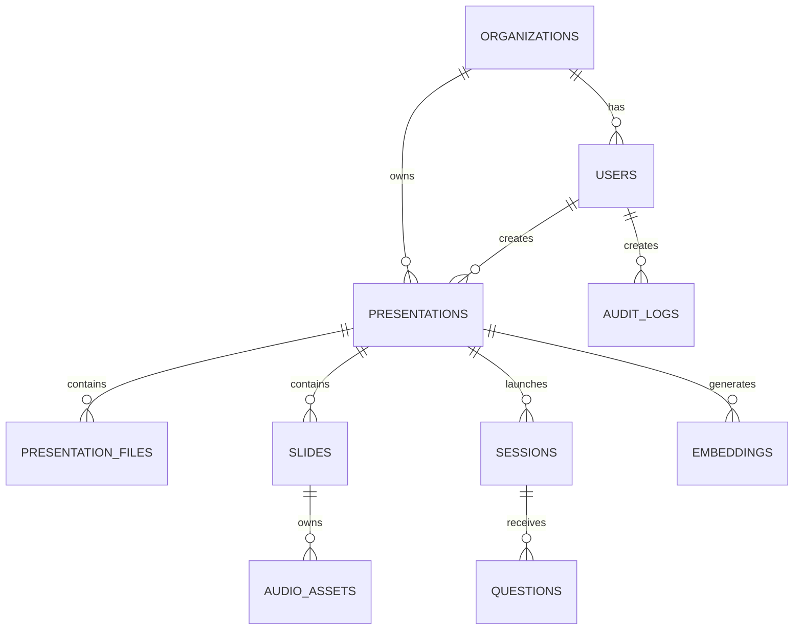

## 6. Database Schema

### Database Philosophy

Database dirancang menggunakan pendekatan:

```text
PostgreSQL
+
Multi-Tenant Ready
+
Audit Friendly
+
Analytics Friendly
```

Prinsip utama:

- Soft Delete Friendly
- Event Tracking Friendly
- AI Usage Tracking Friendly
- Future Enterprise Expansion Ready

---

## Mermaid ERD



---

## Entity: organizations

### Purpose

Menyimpan tenant organisasi.

| Column | Type | Constraint | Index | Default | Notes |
|----------|----------|----------|----------|----------|----------|
| id | UUID | PK | Yes | UUID | Tenant ID |
| name | VARCHAR(255) | NOT NULL | Yes | - | Organization Name |
| slug | VARCHAR(255) | UNIQUE | Yes | - | URL Identifier |
| plan | VARCHAR(50) | NOT NULL | Yes | trial | Subscription Plan |
| status | VARCHAR(50) | NOT NULL | Yes | active | Status |
| created_at | TIMESTAMP | NOT NULL | Yes | now() | Timestamp |
| updated_at | TIMESTAMP | NOT NULL | Yes | now() | Timestamp |

---

## Entity: users

### Purpose

Menyimpan user organisasi.

| Column | Type | Constraint |
|----------|----------|----------|
| id | UUID | PK |
| organization_id | UUID | FK |
| email | VARCHAR(255) | UNIQUE |
| password_hash | TEXT | NOT NULL |
| role | VARCHAR(50) | NOT NULL |
| status | VARCHAR(50) | NOT NULL |
| created_at | TIMESTAMP | NOT NULL |
| updated_at | TIMESTAMP | NOT NULL |

Roles:

```text
SUPER_ADMIN
ORG_ADMIN
OPERATOR
VIEWER
```

---

## Entity: presentations

### Purpose

Master data presentasi.

| Column | Type |
|----------|----------|
| id | UUID |
| organization_id | UUID |
| created_by |
UUID |
| title | VARCHAR(500) |
| description | TEXT |
| language | VARCHAR(20) |
| status | VARCHAR(50) |
| total_slides | INTEGER |
| estimated_duration | INTEGER |
| created_at | TIMESTAMP |
| updated_at | TIMESTAMP |

Status:

```text
draft
processing
ready
live
completed
archived
```

---

## Entity: presentation_files

### Purpose

File management.

| Column | Type |
|----------|----------|
| id | UUID |
| presentation_id | UUID |
| file_name | TEXT |
| file_type | VARCHAR |
| size_bytes | BIGINT |
| storage_path | TEXT |
| status | VARCHAR |
| created_at | TIMESTAMP |

---

## Entity: slides

### Purpose

Slide hasil parsing.

| Column | Type |
|----------|----------|
| id | UUID |
| presentation_id | UUID |
| slide_number | INTEGER |
| title | TEXT |
| content | JSONB |
| notes | TEXT |
| script | TEXT |
| duration_seconds | INTEGER |

---

## Entity: audio_assets

### Purpose

Audio hasil TTS.

| Column | Type |
|----------|----------|
| id | UUID |
| slide_id | UUID |
| provider | VARCHAR |
| storage_path | TEXT |
| duration_seconds | INTEGER |

---

## Entity: sessions

### Purpose

Live presentation session.

| Column | Type |
|----------|----------|
| id | UUID |
| presentation_id | UUID |
| status | VARCHAR |
| started_at | TIMESTAMP |
| ended_at | TIMESTAMP |
| audience_count | INTEGER |

---

## Entity: questions

### Purpose

Question history.

| Column | Type |
|----------|----------|
| id | UUID |
| session_id | UUID |
| question | TEXT |
| answer | TEXT |
| moderation_result | JSONB |
| source_references | JSONB |
| created_at | TIMESTAMP |

---

## Entity: embeddings

### Purpose

Vector knowledge storage metadata.

| Column | Type |
|----------|----------|
| id | UUID |
| presentation_id | UUID |
| source_type | VARCHAR |
| source_id | UUID |
| chunk_text | TEXT |
| embedding_reference | TEXT |

---

## Entity: audit_logs

### Purpose

Audit trail.

| Column | Type |
|----------|----------|
| id | UUID |
| user_id | UUID |
| action | VARCHAR |
| entity_type | VARCHAR |
| entity_id | UUID |
| metadata | JSONB |
| created_at | TIMESTAMP |

---

## 7. Design & Technical Constraints

# Technology Stack

### Frontend

| Technology | Reason |
|------------|------------|
| Next.js | Existing stack |
| TypeScript | Type safety |
| TanStack Query | Data fetching |
| Zustand | State management |
| Socket.IO Client | Realtime |
| Three.js | Avatar integration |

---

### Backend

| Technology | Reason |
|------------|------------|
| NestJS | Existing codebase |
| TypeScript | Shared typing |
| BullMQ | Queue processing |
| Socket.IO | Realtime |

---

### Database

| Technology | Reason |
|------------|------------|
| PostgreSQL | Relational consistency |
| pgvector | RAG search |

---

### Cache

| Technology | Reason |
|------------|------------|
| Redis | Existing ecosystem |

---

### Storage

| Technology | Reason |
|------------|------------|
| MinIO | S3 compatible |

---

### AI

| Technology | Reason |
|------------|------------|
| OpenAI | Existing provider |
| Whisper | STT |
| OpenAI TTS | Voice |
| Existing Avatar Engine | Production ready |

---

### DevOps

| Technology | Reason |
|------------|------------|
| Docker | Standardization |
| Kubernetes | Scalability |
| GitHub Actions | CI/CD |

---

### Monitoring

| Technology | Reason |
|------------|------------|
| Prometheus | Metrics |
| Grafana | Dashboard |
| Loki | Logs |
| OpenTelemetry | Tracing |

---

# UI/UX Design Rules

## Design Philosophy

LORESCALE harus terlihat:

```text
Enterprise
Professional
AI Native
Premium
Minimal
```

---

## Typography

### Sans Stack

```css
Inter,
SF Pro Display,
Segoe UI,
Roboto,
Helvetica,
Arial,
sans-serif
```

---

### Serif Stack

```css
Merriweather,
Georgia,
Times New Roman,
serif
```

---

### Monospace Stack

```css
JetBrains Mono,
SF Mono,
Fira Code,
Consolas,
monospace
```

---

### Variable Font

Recommended:

```text
Inter Variable
```

---

## Grid System

Desktop:

```text
12 Columns
```

Tablet:

```text
8 Columns
```

Mobile:

```text
4 Columns
```

---

## Responsive Breakpoints

```css
xs: 0px
sm: 640px
md: 768px
lg: 1024px
xl: 1280px
2xl: 1536px
```

---

## Spacing Scale

```text
4
8
12
16
24
32
48
64
96
128
```

---

## Radius

```text
sm = 6px
md = 10px
lg = 16px
xl = 24px
```

---

## Elevation

```text
Level 1
Level 2
Level 3
Level 4
Level 5
```

Menggunakan design tokens.

---

## Animation Rules

Avatar Animation:

```text
60 FPS
```

UI Animation:

```text
150ms–300ms
```

Page Transition:

```text
300ms
```

---

## Accessibility

Target:

```text
WCAG 2.1 AA
```

Requirements:

- Keyboard Navigation
- Screen Reader Support
- Focus States
- Color Contrast

---

# API & Integration Standards

## API Style

```text
REST API
```

---

## Versioning

```text
/api/v1/*
```

Future:

```text
/api/v2/*
```

---

## Endpoint Convention

Example:

```http
GET /api/v1/presentations

POST /api/v1/presentations

GET /api/v1/presentations/:id

DELETE /api/v1/presentations/:id
```

---

## Authentication

Required:

```text
JWT
```

Headers:

```http
Authorization: Bearer <token>
```

---

## Authorization

RBAC:

```text
SUPER_ADMIN
ORG_ADMIN
OPERATOR
VIEWER
```

---

## Pagination

```http
?page=1&limit=20
```

Response:

```json
{
  "items": [],
  "total": 100,
  "page": 1,
  "limit": 20
}
```

---

## Validation

Validation Layer:

```text
DTO
Class Validator
```

Rules:

- Required
- Length
- Format
- Type

---

## Error Response Standard

```json
{
  "success": false,
  "code": "PRESENTATION_NOT_FOUND",
  "message": "Presentation not found",
  "requestId": "req_xxx"
}
```

---

# Security & Compliance

## Input Validation

Every request:

```text
Validate
Sanitize
Normalize
```

---

## XSS Prevention

Frontend:

```text
Escape HTML
```

Backend:

```text
Sanitize Inputs
```

---

## SQL Injection Prevention

Rule:

```text
Parameterized Queries Only
```

---

## CSRF

Required for:

```text
Cookie Based Flows
```

---

## Content Security Policy

Example:

```text
default-src 'self'
```

---

## Secure Headers

Required:

```text
HSTS
X-Frame-Options
X-Content-Type-Options
Referrer-Policy
```

---

## Encryption

At Rest:

```text
AES-256
```

In Transit:

```text
TLS 1.3
```

---

## Secrets Management

Never stored in:

```text
Git
Frontend
Docker Image
```

Use:

```text
Environment Secrets
Secret Manager
```

---

## Audit Logging

Track:

- Login
- Upload
- Delete
- Session Start
- Session End
- Q&A

---

## AI Security Layer

Mandatory:

```text
Prompt Injection Detection
Jailbreak Detection
Toxicity Detection
Profanity Detection
PII Detection
```

---

# Performance & Scalability

## Target Response Times

| Service | Target |
|----------|----------|
| API | <300ms |
| Dashboard | <2s |
| Search | <1s |
| Q&A | <2s |

---

## Caching Strategy

Redis Cache:

```text
Presentation Metadata
User Session
Analytics Summary
```

TTL:

```text
5m–60m
```

---

## Database Optimization

Required:

- Indexing
- Query Optimization
- Connection Pooling

---

## CDN Strategy

Assets:

```text
Audio
Images
Avatar Assets
```

---

## Queue Strategy

BullMQ Queues:

```text
ppt-processing
script-generation
audio-generation
embedding-generation
analytics-processing
```

---

## Horizontal Scaling

Scale:

```text
Frontend Pods
Backend Pods
Worker Pods
```

Independently.

---

## Vertical Scaling

Used only for:

```text
Database
```

---

# Code Quality & Development Standards

## Recommended Folder Structure

```text
apps/
 ├── web
 └── api

packages/
 ├── ui
 ├── types
 ├── config
 └── shared
```

---

## Backend Structure

```text
src/

modules/
  auth/
  users/
  presentations/
  sessions/
  questions/
  analytics/

common/

infrastructure/
```

---

## Architecture Pattern

```text
Modular Monolith
```

MVP.

Future:

```text
Service Extraction
```

when scale requires.

---

## Naming Convention

### Files

```text
kebab-case
```

### Components

```text
PascalCase
```

### Variables

```text
camelCase
```

### Constants

```text
UPPER_CASE
```

---

## Documentation Standard

Required:

- README
- ADR
- API Docs
- Runbooks

---

## Testing Strategy

### Unit Test

Coverage:

```text
>80%
```

---

### Integration Test

Coverage:

```text
Critical Flows
```

---

### E2E Test

Coverage:

```text
Presentation Lifecycle
```

---

## Git Workflow

```text
main
develop
feature/*
hotfix/*
```

---

## Deployment & Observability

### Deployment Strategy

```text
Blue Green Deployment
```

Preferred.

Fallback:

```text
Rolling Update
```

---

### Environments

```text
local
development
staging
production
```

---

### Monitoring

Metrics:

- CPU
- Memory
- API Latency
- Queue Depth
- Active Sessions

---

### Logging

Centralized Logging:

```text
Loki
```

---

### Metrics

Collected:

- Business Metrics
- Technical Metrics
- AI Metrics

---

### Error Tracking

Recommended:

```text
Sentry
```

---

### Backup

Database:

```text
Hourly
```

Storage:

```text
Daily
```

---

### Disaster Recovery

RPO:

```text
15 Minutes
```

RTO:

```text
1 Hour
```

---

## 8. Recommendations & Future Development

### Recommended Enhancements

#### Phase 2

- QR Based Question Submission
- Mobile Audience Portal
- Live Subtitle
- Multi Voice Profiles
- Session Replay

---

#### Phase 3

- Multi Avatar Support
- AI Panel Discussion
- AI Co-Presenter
- Multi Language Live Switching

---

#### Phase 4

Digital Human Platform:

- AI Presenter
- AI Teacher
- AI Trainer
- AI Receptionist
- AI Customer Service

---

## Key Risks

### Risk 1

AI Hallucination

Mitigation:

```text
RAG First
Source Attribution
Moderation Layer
```

---

### Risk 2

Large PPT Processing

Mitigation:

```text
Queue
Chunk Processing
Worker Scaling
```

---

### Risk 3

OpenAI Cost Explosion

Mitigation:

```text
Caching
Prompt Optimization
Token Tracking
Usage Quotas
```

---

### Risk 4

Long Running Sessions

Mitigation:

```text
Heartbeat
Auto Recovery
State Persistence
```

---

## Technical Debt Watchlist

### Future Refactor Candidates

- Session Engine
- AI Orchestration Layer
- Retrieval Service
- Analytics Pipeline

---

## Assumptions

Assumsi yang digunakan dalam dokumen ini:

- Existing production avatar infrastructure tersedia.
- Existing OpenAI integration tersedia.
- Existing NestJS backend tersedia.
- Existing Next.js frontend tersedia.
- Existing object storage tersedia.
- Existing authentication system tersedia.

---

## Open Questions for Future Iterations

- White-label strategy.
- Enterprise dedicated deployment.
- AI model abstraction layer.
- Multi-region deployment.
- Video export generation.
- AI generated presentation creation.
- Real-time translation.

---

## Final Vision

LORESCALE AI Presenter bukan hanya fitur presentasi otomatis, tetapi fondasi menuju platform Digital Human yang mampu menyampaikan informasi, mengajar, melatih, menjawab pertanyaan, dan berinteraksi secara natural dengan manusia dalam skala enterprise.

Target akhir platform:

```text
Presentation Intelligence
        ↓
Interactive AI Presenter
        ↓
Digital Human Platform
        ↓
Enterprise Knowledge Delivery System
```